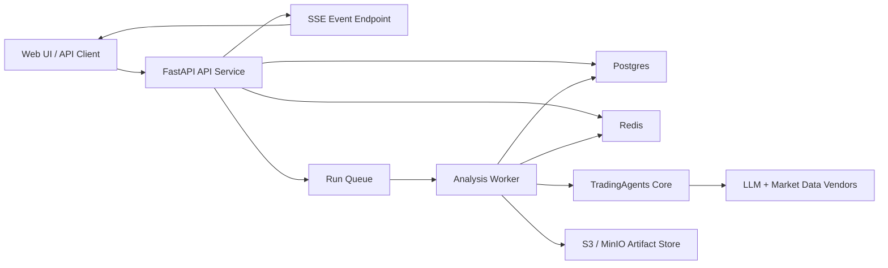

# Multi-Tenant Web Service Design

## Goal

Transform TradingAgents from a CLI-first local analysis tool into a multi-tenant web service that supports authenticated users, asynchronous long-running analysis jobs, streamed progress updates, isolated run state, durable artifacts, and production-oriented operations.

## Scope

This design covers the first production-capable service architecture built on top of the current repository.

In scope:

- Add a service-oriented entry point for creating and managing analysis runs over HTTP.
- Support multiple users and tenants with strong run isolation.
- Move long-running analysis execution out of the request path into background workers.
- Persist run metadata, status, events, reports, and artifacts outside process memory.
- Stream progress updates to clients while a run is executing.
- Preserve the existing TradingAgents graph, analysts, and vendor adapters as the core execution engine.
- Define the target deployment topology, storage model, and operational boundaries for a first production release.

Out of scope for the first pass:

- Brokerage execution or real trading integration.
- Real-time market streaming and intraday sub-second execution.
- Custom bring-your-own-key management for each tenant.
- Full workflow-orchestration migration to Temporal or equivalent.
- A polished end-user web frontend beyond basic compatibility with a future UI.

## Product Assumptions

This design assumes the first service release is an internal or controlled external platform for research analysis, not a public anonymous endpoint.

Assumptions:

- Users authenticate before creating runs.
- The platform owns the upstream market-data and LLM credentials in the first release.
- A run may take tens of seconds to several minutes.
- Clients need incremental status updates, not just a final report.
- Horizontal scaling matters more than strict low-latency response time.

## Current-State Findings

The current codebase already has a strong reusable execution core but is still organized around a single-user local process model.

### Reusable Today

- `tradingagents/graph/trading_graph.py` exposes a programmatic `TradingAgentsGraph.propagate(...)` entry point.
- `tradingagents/reporting.py` already produces report artifacts independent of the Rich CLI presentation.
- The graph, analyst, and dataflow layers are mostly transport-agnostic as long as they receive a config and can write outputs somewhere.

### Not Service-Safe Today

- `tradingagents/dataflows/config.py` stores runtime config in a module-global `_config`, which is unsafe for multi-user concurrent execution.
- `TradingAgentsGraph.__init__` calls `set_config(self.config)`, which lets one run mutate process-wide config for another run.
- `tradingagents/agents/utils/memory.py` writes to a shared markdown memory log path, which would leak context across users or tenants.
- `tradingagents/graph/checkpointer.py` keys checkpoint state by `ticker + date`, which is not unique across users and runs.
- `tradingagents/graph/trading_graph.py` and `cli/main.py` assume filesystem-local results, logs, and progress handling.
- `cli/main.py` contains useful progress semantics, but they are bound to Rich TUI rendering rather than reusable event emission.

These constraints mean the recommended architecture should preserve the graph and tool contracts but replace the runtime shell around them.

## Requirements

### 1. Multi-Tenant Isolation

Every run must be scoped by:

- `tenant_id`
- `user_id`
- `run_id`

Isolation requirements:

- One tenant cannot read another tenant's run metadata, events, or artifacts.
- In-process config must not bleed across concurrent runs.
- Checkpoints, caches, reports, and memory must be namespaced per tenant and run.

### 2. Asynchronous Execution

Run creation must not block on the full analysis.

The service must:

- accept a run request quickly,
- enqueue the work,
- return a run identifier,
- execute the analysis in background workers,
- expose status transitions until completion or failure.

### 3. Streamed Progress

Clients must be able to observe progress while a run is executing.

The first release should support:

- run-level status updates,
- agent start and completion,
- tool-call notifications,
- partial report-section updates,
- terminal completion or failure events.

### 4. Durable Persistence

The platform must persist:

- run request parameters,
- execution status,
- event timeline,
- final decision and summary,
- complete report artifacts,
- worker error details,
- audit metadata.

No critical run state should depend on a single API process remaining alive.

### 5. Operational Safety

The service must support:

- retries for transient worker failures,
- explicit cancellation,
- per-tenant authorization checks,
- rate limiting,
- observability for debugging and cost tracking.

## Architecture Options Considered

### Option A: Single FastAPI Process Running Analyses Inline

Pros:

- smallest code delta,
- easiest to prototype.

Cons:

- request timeouts for long runs,
- poor concurrency behavior,
- difficult cancellation,
- weak horizontal scalability,
- process crashes lose in-flight work.

This option is not suitable for the production multi-user goal.

### Option B: FastAPI + Queue + Worker Pool

Pros:

- clean separation between control plane and execution plane,
- easy horizontal scaling,
- natural fit for long-running runs,
- straightforward cancellation and retry control,
- minimal disruption to the existing core graph implementation.

Cons:

- adds infrastructure pieces,
- requires explicit event persistence and artifact handling.

This is the recommended first production architecture.

### Option C: Full Workflow Engine (Temporal or Equivalent)

Pros:

- strongest retry, resume, and workflow durability model,
- rich orchestration primitives.

Cons:

- high adoption cost,
- large conceptual shift,
- unnecessary complexity for the first service release.

This should remain a future evolution path, not the initial migration target.

## Recommended Architecture

Adopt a split architecture with:

- a stateless HTTP API service,
- a background worker service,
- Postgres for durable metadata,
- Redis for queueing and ephemeral coordination,
- object storage for reports and large artifacts.

Concrete stack decisions for the first release:

- HTTP framework: `FastAPI`
- request and response schemas: `Pydantic`
- relational persistence: `SQLAlchemy 2.x + Alembic`
- job execution: `Dramatiq` workers backed by `Redis`
- artifact storage: `S3` API, with `MinIO` as the local development target
- progress transport: `Server-Sent Events`
- container runtime: `Docker Compose` for local integration, leaving room for later Kubernetes deployment

## Service Decomposition

### API Service

Responsibilities:

- authenticate requests,
- authorize tenant-scoped access,
- validate run requests,
- persist run metadata,
- enqueue jobs,
- expose read APIs for status, events, and artifacts,
- handle cancellation requests,
- expose streamed progress via SSE.

The API service must never execute the full trading analysis inline.

### Worker Service

Responsibilities:

- fetch queued runs,
- build an isolated runtime context,
- invoke the TradingAgents execution core,
- emit structured progress events,
- persist final outputs and failure details,
- upload artifacts,
- honor cancellation requests between safe checkpoints.

### TradingAgents Core

Responsibilities:

- keep graph construction, prompts, tool routing, and final decision logic.

Required changes:

- remove reliance on process-global config,
- stop assuming one shared memory log,
- stop using raw local filesystem paths as the only persistence mechanism,
- expose progress in a transport-neutral format.

## Core Runtime Refactor

The central implementation strategy is to extract a reusable execution service from the current CLI flow.

### New Runtime Layers

Recommended new modules:

- `tradingagents/service/runtime_context.py`
- `tradingagents/service/run_service.py`
- `tradingagents/service/event_publisher.py`
- `tradingagents/service/artifact_store.py`
- `tradingagents/service/models.py`

Responsibilities:

- `RuntimeContext`: immutable run-scoped config, IDs, storage prefixes, and cancellation hooks.
- `RunService`: orchestrates one analysis run from request input through final persisted outputs.
- `EventPublisher`: translates graph progress into structured events.
- `ArtifactStore`: writes report trees, JSON state, and logs to local or object-backed storage through one interface.
- `models.py`: shared request/result/event schemas.

### CLI Compatibility

The CLI should become a thin client over the same service layer where practical.

The Rich presentation code can remain CLI-specific, but it should consume structured run events instead of directly owning the only graph-execution path.

## Progress and Event Model

The current CLI already tracks:

- messages,
- tool calls,
- agent state transitions,
- report-section updates.

That logic should be converted into a structured event stream rather than terminal rendering side effects.

Recommended event types:

- `run.created`
- `run.queued`
- `run.started`
- `agent.started`
- `agent.completed`
- `tool.called`
- `report.section_updated`
- `run.completed`
- `run.failed`
- `run.cancelled`

Each event should carry:

- `event_id`
- `run_id`
- `tenant_id`
- `timestamp`
- `type`
- `payload`

The API should expose events over Server-Sent Events first. SSE is sufficient because the primary interaction is one-way server-to-client progress delivery.

## Data Model

### Postgres

Recommended tables:

- `tenants`
- `users`
- `api_keys` or `sessions` depending on auth strategy
- `runs`
- `run_events`
- `run_artifacts`
- `run_costs`
- `audit_logs`

Minimum `runs` fields:

- `id`
- `tenant_id`
- `user_id`
- `status`
- `ticker`
- `analysis_date`
- `asset_type`
- `selected_analysts`
- `config_snapshot`
- `created_at`
- `started_at`
- `completed_at`
- `error_code`
- `error_message`
- `final_decision_summary`

### Redis

Use Redis for:

- job queue transport,
- short-lived live progress fan-out,
- cancellation flags,
- optional rate-limit counters.

Redis should not be the source of truth for final run state.

### Object Storage

Persist large or file-shaped outputs under a namespaced prefix such as:

- `tenants/{tenant_id}/runs/{run_id}/complete_report.md`
- `tenants/{tenant_id}/runs/{run_id}/full_state.json`
- `tenants/{tenant_id}/runs/{run_id}/reports/...`
- `tenants/{tenant_id}/runs/{run_id}/message_tool.log`

This avoids binding the service to any one worker filesystem.

## Isolation Strategy

### Config Isolation

The current global config model must be replaced or bypassed.

Required design rule:

- every run gets an immutable config snapshot built before queue submission,
- no module-global mutable config can affect another run.

Preferred direction:

- replace `dataflows.config` global access with an explicit run-scoped config object passed through graph setup and tool execution,
- or, as an intermediate step, execute one run per worker process with strictly isolated process state.

The final target should be true run-scoped config, not reliance on single-thread worker discipline.

### Memory Isolation

The current shared markdown memory log must become tenant-scoped or be disabled for the first release.

Recommended first-release behavior:

- move memory storage behind an interface,
- default to run-isolated memory with no cross-run recall,
- allow an explicit future upgrade path to tenant-scoped shared memory behind a feature flag.

Cross-tenant shared memory is forbidden.

### Checkpoint Isolation

Checkpoint identity must include `tenant_id` and `run_id`, not just `ticker + date`.

Recommended checkpoint key:

- `{tenant_id}:{run_id}`

Checkpoint persistence should move behind a storage abstraction so the implementation can remain SQLite-backed initially but with namespaced paths or evolve to database-backed checkpoint storage later.

## API Contract

Recommended initial endpoints:

- `POST /v1/runs`
- `GET /v1/runs/{run_id}`
- `GET /v1/runs/{run_id}/events`
- `POST /v1/runs/{run_id}/cancel`
- `GET /v1/runs/{run_id}/artifacts`
- `GET /v1/runs/{run_id}/report`
- `GET /v1/providers`

### Run Creation Request

The request should capture:

- ticker,
- analysis date,
- asset type,
- selected analysts,
- model/provider choices allowed by policy,
- output language,
- optional profile or research-depth settings.

The server should snapshot the resolved config so the exact execution context is auditable later.

### Run Status Response

A status response should include:

- lifecycle status,
- timestamps,
- latest event summary,
- final decision summary if completed,
- artifact references if available.

## Authentication and Authorization

The first production version should support authenticated users and tenant scoping.

Recommended first-release pattern:

- API gateway or application-level JWT/session auth,
- tenant membership checks on every read and write,
- service-side platform-managed vendor credentials.

Future extension:

- tenant-owned encrypted credentials for provider-specific runs.

## Error Handling and Retry Model

Failures should be classified as:

- validation failures,
- upstream vendor failures,
- transient worker infrastructure failures,
- deterministic graph execution failures,
- cancellation.

Retry policy:

- do not retry invalid user requests,
- selectively retry transient infrastructure and network failures,
- cap retries and persist failure reason,
- preserve partial artifacts when useful for debugging.

## Cancellation Model

Cancellation is required for production operations because runs may be expensive.

Recommended behavior:

- API marks run as `cancelling`,
- worker checks cancellation between graph chunks or tool boundaries,
- worker writes terminal `cancelled` status,
- partial artifacts remain available unless policy requires cleanup.

Hard immediate process termination should be avoided because it risks corrupting checkpoints or losing final logs.

## Observability

The platform should collect:

- structured logs with `run_id`, `tenant_id`, and `worker_id`,
- metrics for queue depth, run duration, success rate, retry rate, and vendor failure rate,
- token usage and cost summaries where upstream metadata exists,
- traces or per-step timing for slow-run diagnosis.

The existing CLI stats callback is a useful seed for cost and token accounting but should be persisted as run metrics rather than displayed only in terminal UI.

## Security

Security requirements for the first release:

- authenticate all endpoints,
- authorize every tenant-scoped resource lookup,
- never expose provider API keys to clients,
- sanitize stored logs and errors to avoid credential leakage,
- isolate artifact storage by tenant prefix,
- validate all user-supplied tickers and config fields against allowlists where appropriate.

## Deployment Topology

Recommended initial deployment units:

- `api` container,
- `worker` container,
- `postgres`,
- `redis`,
- `minio` or managed S3,
- optional reverse proxy.

The current Docker setup is CLI-oriented and should be replaced with service-specific compose targets or Kubernetes manifests later.

## Migration Plan

### Phase 1: Service Skeleton

- Introduce API and worker services.
- Define run schemas and persistence tables.
- Enqueue dummy runs and return lifecycle status.

### Phase 2: Core Execution Extraction

- Extract CLI execution flow into reusable service modules.
- Run real analyses in workers.
- Persist final reports and JSON state.

### Phase 3: Live Progress and Cancellation

- Emit structured run events.
- Expose SSE endpoint.
- Add cancellation handling.

### Phase 4: Isolation Hardening

- Remove process-global config reliance.
- Namespace memory and checkpoints.
- Tighten multi-tenant authorization and audit coverage.

### Phase 5: Production Hardening

- Add rate limiting, retry policies, dashboards, alerts, and cost tracking.

## Recommended First Implementation Slice

The first implementation should target a thin but production-shaped service:

- FastAPI API service
- Redis-backed job queue
- one worker type for analysis jobs
- Postgres-backed run metadata and event tables
- object storage-backed artifacts
- SSE progress streaming
- run-scoped config snapshotting
- tenant-scoped artifact and checkpoint prefixes

This slice is large enough to validate the architecture without prematurely introducing workflow-engine complexity.

## Design Decisions Summary

- Preserve the existing graph and analyst engine.
- Replace CLI-owned runtime orchestration with a reusable service layer.
- Use asynchronous workers rather than inline request execution.
- Treat Postgres as the source of truth, Redis as coordination, and object storage as artifact persistence.
- Use SSE first for progress delivery.
- Enforce tenant and run isolation at config, memory, checkpoint, and artifact layers.

## Success Criteria

The design is successful when:

- multiple authenticated users can submit runs concurrently,
- each run executes without leaking config or artifacts across tenants,
- clients can observe progress without blocking the create request,
- completed runs remain inspectable after process restarts,
- the service can scale API and worker instances independently,
- the repository still preserves a clean boundary around the existing TradingAgents execution core.
